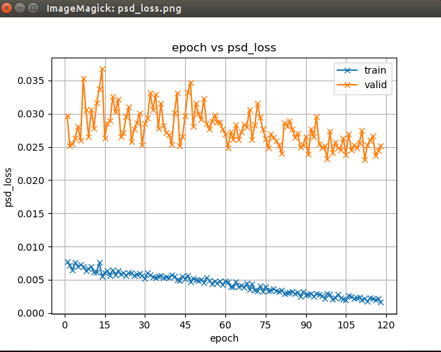

| Header One     | Header Two     | |
| :------------- | :------------- |:------ |
|  1  | train/eval BC13_GST_fbank <br>        |  <br>  |
|  18  | modify and start train emocontrlTTS<br>        |  NO  |
|  19  | modify and start train emocontrlTTS<br>        |  NO  |
|  20  | modify and start train emocontrlTTS<br>        |  NO  |


1/1
1. get good result of blizzard2013 with gst in abci
  - use alone text1/wav1
  - limit length of audio in 2 ~ 10s ()
  - try hs add before attention and hs concatenate after attention

1/2
2. Reimplement blizzard2013
  - with Controllable tts

1/7
1. Finish Writing Protest Abstract => file [here](../../../Desktop/tkfd/protest/Apsa/v1.docx)

2. Finish training SER model

3. evaluate SER model in Blizzard13
  - Adaption test: 10 sad/happy/angry/normal => test works


4. evaluate GST again
  - Reference test only, compare with pretrained GST

5.

1/18
Problem
  1. only 1 batch

1/19
2. Add emo_lab/emo_distribution(?) along with encoded text as prosody encoder input
  -

1/20
  Learn:
    - input any data in tts.sh by path_name_type, and it will appear in forward(\**batch)
    - args in forward/inference of model == name of path_name_type in tts.sh
    - somedata_lengths is auto computed

1/21
  - Finish modify controllable emo-tts_model
  -

- 1/22
  - Evaluate blizzard13 with IEMOCAP
  - training properly
    1. batch = 1?
    2. reporter have no prosody weighted => check
    3. modify 1 line emo_feats in dev and train

- 1/23
  - Start evaluating blizzard2013(5000 sentences) and check pre_trained model
      - ?
  - Implement middle-level Espnet_emoTTS model with feats extract of
      - contrl tts
      - contrl emotts
          -
  - Training controllable emoTTS
  - Implement Experiment
      - When model == contrl_tts
         -
lstmcell pytorch Reproducibility


1/29
  - EXP ()
    - why psd_loss not convergence?
      - Check compute
      - text -> psd is not possible
        
    - evaluated pitch and energy is not linearly controllable!
      - 3 h_s added into prosody LOSS
      -

```python

def extract_emo(wav_scp, out_csv):
  pd_path = pd.readCSV(wav_scp)
  pd_emo = pd.Dataframe()
  for name,path in pd_path[0]:
    emo_feat = extract_emo_feats[path]
    pd_emo.append(name, emo_feat)
  pd.writeCSV(pd_emo, out_csv)


## path name type
opt += out_csv + "feats" + "csvtext"
```

1/31
- feats ->(NN) emos ->(NN) feats(prosody)  <= NO VAE   (2_2h/2_20h: eval_A/eval_B)
  -
  - Check Loss

  - entropy_loss(emos) + abs(feats - pred_feats)

  - NN(NN1 = NN2):
    - FC: 2layers (8:128, 128:5, softmax) (5:128, 128:8, tahn) <=
    - LSTM: 2layers: (8:50, 50:5) ()

  - Training Process
    - Loss
      - When Iemocap
        - LOSS = PSD + EMO                            => Check Loss Curve drop
      - When Blizzard13   
        - Loss = PSD (emo-classifier is fixed)
        - fine tuning with pre-trained NN1 and NN2    => Fine Tuning
        - Fine tuning Tacotron2 part
      - PSD Loss = SUM(MSE(emo_feats - emo_feats_pred ))
      - Emo_Loss = entropy_loss(emo_lab, emo_lab_pred)

- feats ->(NN) emos ->(NN) feats(prosody)  <= VAE (3_?)


## Other
- warm starting
<file_path>:<src_key>:<dst_key>:<exclude_Keys>
modelB = TheModelBClass(\*args, \**kwargs)
modelB.load_state_dict(torch.load(PATH), strict=False)

- Reproducibility of lstm
  - lstm = ZoneOutCell(lstm, zoneout_rate) ? => No

- Zoneout
  - LSTM: Forgot gate(remember: sigmoid), Input gate(Save: tahn*sigmoid), Output gate(focus: sigmoid)
  - The repeated application of the same transition operator at the different time steps of the sequence. however, can
make the dynamics of an RNN sensitive to minor perturbations in the hidden state; the transition dynamics can magnify components of these perturbations exponentially


- cut down float in feats

- F.normalize() of spkemb

torch                  1.4.0 => 1.7.0


model ser param: odict_keys(['tts.enc.embed.weight', 'tts.enc.convs.0.0.weight', 'tts.enc.convs.0.1.weight', 'tts.enc.convs.0.1.bias', 'tts.enc.convs.0.1.running_mean', 'tts.enc.convs.0.1.running_var', 'tts.enc.convs.0.1.num_batches_tracked', 'tts.enc.convs.1.0.weight', 'tts.enc.convs.1.1.weight', 'tts.enc.convs.1.1.bias', 'tts.enc.convs.1.1.running_mean', 'tts.enc.convs.1.1.running_var', 'tts.enc.convs.1.1.num_batches_tracked', 'tts.enc.convs.2.0.weight', 'tts.enc.convs.2.1.weight', 'tts.enc.convs.2.1.bias', 'tts.enc.convs.2.1.running_mean', 'tts.enc.convs.2.1.running_var', 'tts.enc.convs.2.1.num_batches_tracked', 'tts.enc.blstm.weight_ih_l0', 'tts.enc.blstm.weight_hh_l0', 'tts.enc.blstm.bias_ih_l0', 'tts.enc.blstm.bias_hh_l0', 'tts.enc.blstm.weight_ih_l0_reverse', 'tts.enc.blstm.weight_hh_l0_reverse', 'tts.enc.blstm.bias_ih_l0_reverse', 'tts.enc.blstm.bias_hh_l0_reverse', 'tts.prosody.lstms.weight_ih_l0', 'tts.prosody.lstms.weight_hh_l0', 'tts.prosody.lstms.bias_ih_l0', 'tts.prosody.lstms.bias_hh_l0', 'tts.prosody.lstms.weight_ih_l1', 'tts.prosody.lstms.weight_hh_l1', 'tts.prosody.lstms.bias_ih_l1', 'tts.prosody.lstms.bias_hh_l1', 'tts.prosody.lstms.weight_ih_l2', 'tts.prosody.lstms.weight_hh_l2', 'tts.prosody.lstms.bias_ih_l2', 'tts.prosody.lstms.bias_hh_l2', 'tts.prosody.lns.0.0.weight', 'tts.prosody.lns.0.0.bias', 'tts.ser_rev.ser.0.0.weight', 'tts.ser_rev.ser.0.0.bias', 'tts.ser_rev.ser.1.0.weight', 'tts.ser_rev.ser.1.0.bias', 'tts.ser_rev.in_ser.0.0.weight', 'tts.ser_rev.in_ser.0.0.bias', 'tts.ser_rev.in_ser.1.0.weight', 'tts.ser_rev.in_ser.1.0.bias', 'tts.dec.att.mlp_enc.weight', 'tts.dec.att.mlp_enc.bias', 'tts.dec.att.mlp_dec.weight', 'tts.dec.att.mlp_att.weight', 'tts.dec.att.loc_conv.weight', 'tts.dec.att.gvec.weight', 'tts.dec.att.gvec.bias', 'tts.dec.lstm.0.cell.weight_ih', 'tts.dec.lstm.0.cell.weight_hh', 'tts.dec.lstm.0.cell.bias_ih', 'tts.dec.lstm.0.cell.bias_hh', 'tts.dec.lstm.1.cell.weight_ih', 'tts.dec.lstm.1.cell.weight_hh', 'tts.dec.lstm.1.cell.bias_ih', 'tts.dec.lstm.1.cell.bias_hh', 'tts.dec.prenet.prenet.0.0.weight', 'tts.dec.prenet.prenet.0.0.bias', 'tts.dec.prenet.prenet.1.0.weight', 'tts.dec.prenet.prenet.1.0.bias', 'tts.dec.postnet.postnet.0.0.weight', 'tts.dec.postnet.postnet.0.1.weight', 'tts.dec.postnet.postnet.0.1.bias', 'tts.dec.postnet.postnet.0.1.running_mean', 'tts.dec.postnet.postnet.0.1.running_var', 'tts.dec.postnet.postnet.0.1.num_batches_tracked', 'tts.dec.postnet.postnet.1.0.weight', 'tts.dec.postnet.postnet.1.1.weight', 'tts.dec.postnet.postnet.1.1.bias', 'tts.dec.postnet.postnet.1.1.running_mean', 'tts.dec.postnet.postnet.1.1.running_var', 'tts.dec.postnet.postnet.1.1.num_batches_tracked', 'tts.dec.postnet.postnet.2.0.weight', 'tts.dec.postnet.postnet.2.1.weight', 'tts.dec.postnet.postnet.2.1.bias', 'tts.dec.postnet.postnet.2.1.running_mean', 'tts.dec.postnet.postnet.2.1.running_var', 'tts.dec.postnet.postnet.2.1.num_batches_tracked', 'tts.dec.postnet.postnet.3.0.weight', 'tts.dec.postnet.postnet.3.1.weight', 'tts.dec.postnet.postnet.3.1.bias', 'tts.dec.postnet.postnet.3.1.running_mean', 'tts.dec.postnet.postnet.3.1.running_var', 'tts.dec.postnet.postnet.3.1.num_batches_tracked', 'tts.dec.postnet.postnet.4.0.weight', 'tts.dec.postnet.postnet.4.1.weight', 'tts.dec.postnet.postnet.4.1.bias', 'tts.dec.postnet.postnet.4.1.running_mean', 'tts.dec.postnet.postnet.4.1.running_var', 'tts.dec.postnet.postnet.4.1.num_batches_tracked', 'tts.dec.feat_out.weight', 'tts.dec.prob_out.weight', 'tts.dec.prob_out.bias', 'tts.taco2_cotrl_loss.bce_criterion.pos_weight'])

pre-trained ser param: odict_keys(['ser.0.0.weight', 'ser.0.0.bias', 'ser.1.0.weight', 'ser.1.0.bias', 'in_ser.0.0.weight', 'in_ser.0.0.bias', 'in_ser.1.0.weight', 'in_ser.1.0.bias'])


--model /home/Data/blizzard2013_part_preprocess/exp_remote/tts_train_fbank_phn_tacotron_emocontrl_g2p_en_no_space/37epoch.pth --config /home/Data/blizzard2013_part_preprocess/exp_remote/tts_train_fbank_phn_tacotron_emocontrl_g2p_en_no_space/config.yaml --text "Get out of my way." --out_dir /home/rosen/Project/espnet/egs2/blizzard2013/tts3/exp_res --emo_labs "0.3 0.3 0.3 0.3 0.3 0.3 0.3 0.1"


--model /home/Data/blizzard2013_part_preprocess/exp_remote/tts_train_fbank_phn_tacotron_g2p_en_no_space/81epoch.pth --config /home/Data/blizzard2013_part_preprocess/exp_remote/tts_train_fbank_phn_tacotron_g2p_en_no_space/config.yaml --text "I want to graduate quickly" --out_dir /home/rosen/Project/espnet/egs2/blizzard2013/tts3/exp_res --ref_dir /home/rosen/Project/espnet/ref_audio/emotion --emo_feats "0.3 0.3 0.3 0.3 0.3 0.3 0.3 0.3"


--model /home/Data/blizzard2013_part_preprocess/exp_remote/tts_train_fbank_phn_tacotron_emocontrl_dnn2_128_g2p_en_no_space/37epoch.pth --config /home/Data/blizzard2013_part_preprocess/exp_remote/tts_train_fbank_phn_tacotron_emocontrl_dnn2_128_g2p_en_no_space/config.yaml --text "Get out of my way." --out_dir /home/rosen/Project/espnet/egs2/blizzard2013/tts3/exp_res --emo_labs "0.3 0.3 0.3 0.3 0.3 0.3"


--model /home/Data/blizzard2013_part_preprocess/exp_remote/tts_train_fbank_phn_tacotron_emocontrl_dnn3_256_g2p_en_no_space/105epoch.pth --config /home/Data/blizzard2013_part_preprocess/exp_remote/tts_train_fbank_phn_tacotron_emocontrl_dnn3_256_g2p_en_no_space/config.yaml --text "Get out of my way." --out_dir /home/rosen/Project/espnet/egs2/blizzard2013/tts3/exp_res --emo_labs "1 0 0 0 0 0"
