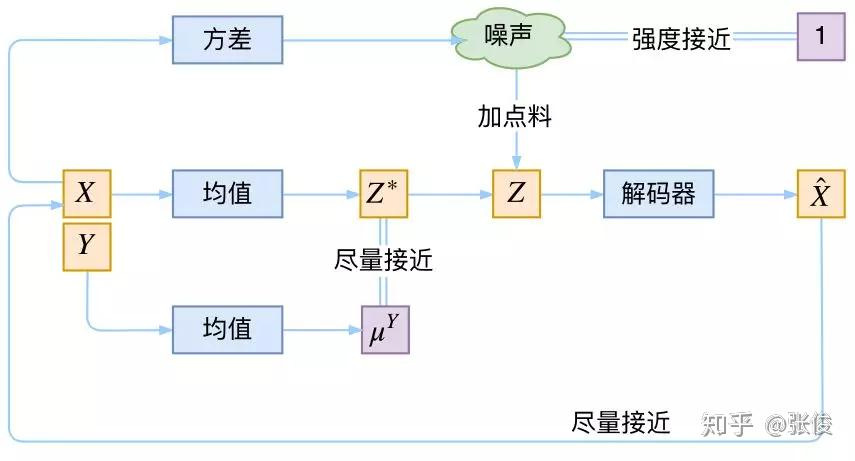

| Header One     | Header Two     | |
| :------------- | :------------- |:------ |
|  1  | train/eval BC13_GST_fbank <br>        |  <br>  |
|  18  | modify and start train emocontrlTTS<br>        |  NO  |
|  19  | modify and start train emocontrlTTS<br>        |  NO  |
|  20  | modify and start train emocontrlTTS<br>        |  NO  |


2/3:
1. Vocoder - Gan implement or grifflim
  - grifflim problem
  - n_fft, hop_length, window_length, n_mels
  - iven_mel_basis * (mel_basis * mags) != mags ??
    - np.linalg.pinv(mel_basis) psuedo inverse matrix is problem?
    - mels -> mags is lossy Process, and make sure frequency warping is similar with mels extracting, otherwise disharmonic audio


2. Implement Category VAE
  - Dim(z) = base_dim(z) * Categories ? why?
  - no Linear model for mu, theta ?



2/5
- Learn to see spectrogram
  - Pitch rise/drop ?
  -
- See the every detail in each stage to check the training Process
  - emo VS emo_feats!


2/9

decode/syn in espnet1
1. decode and synthesis step

decode/syn in espnet2
1. Dot(invers_mel_basis, mags) directly in logmel2linear of Text2speech.
2. Vocoder by parallel_wavegan

2/10

- Jane-eye sample rate
  - re-extract feats/emo-feats again
  - **fmax=7600, fmin=80**


- Training multiple model
  - tacotron2
  - tacotron2_contrl
  - tacotron2_emocontrl_dnn
  - tacotron2_emocontrl_cvae (2h)
  (
    - exp name
    - eval data setting
    -
  )


2/11
- check fs in emofeats extraction
- reduce to ang, hap, sad, neutral?
- evaluate b2013 data

- Check Correct and Computable of emotional sub space   ORDER1 (2h)
  - data: iemocap(eval)
  - model: DNN_3_256
  - Vis: 6 space -> 3 space
  - **Check Correctness**
    - color = label   =>
      - Sad,Hap,Ang is confused
      - fear is clearly clustered
  - **Check Computable**
    - color_durkness = label_dims =>
      - How load graduate color by probs ?

- Check conversion from emo to psd


- Check if emo audio is generated correctly with psd vector


2/12
- Organize the Paper structure
  -
- Check the data evaluation method
  -

2/16
1. Start evaluating UCLA_data
2. Build up research frame_work
3. Start training new emoTTS

Learned
- inference in Paddle is implemented by c++ (semi-onnxruntime?)
- Way to assemble models
- parse yaml config

2/18
1. joint_det/detrec args    1h
2. training environment set 2h
3. Evalution setting        1h


2/19
1. re-Generate 5 emotion audio with proper emo_labs
2. Draw the emotion map with text and emo_feats
3. input_feats <-> out_feats linear relation

2/20
1. Path problem
>>> PROJ_DIR = 'xxxx'
>>> sys.path.append(os.path.join(PROJ_DIR, 'nmt'))


## useful code
```python
#
module_class = eval(config["model_name"])(**config)

# 2/18 Way to assemble models
self.backbone = build_backbone(config["backbone"])
self.neck = build_neck(config["neck"])
...
# build_backbone.py
import resnet, mobilenet
assert config["model_name"] in ["resnet", "mobilenet"] Exception(
  "backbone only support {}".format("resnet, mobilenet")
)
module_class = eval(config["model_name"])(**config)
return module_class

# config.yaml
Architect:
  backbone:
    name: resnet
    scale: 0.5
  neck:
    name: DBFPN
    out_channels: 256
  Head:
    name: DBHead
    k: 50

# Generate train/inference args


os.makedirs(save_model_dir, exist_ok=True)
_, ext = os.path.splitext(file_path)
assert ext in ['.yml', '.yaml'], "only support yaml files for now"
merge_config(yaml.load(open(file_path, 'rb'), Loader=yaml.Loader))


```

## other

2464
2472


3 psd encoder candidate In training
1. text ->(text_psd) psd + [txt_enc] -> mels
2. audio -> emofeats -> emolabs ->(emo_feats_psd) psd + [txt_enc] -> mels  (problem in inference)
3. text + emo_labs ->(text_emo_psd) psd + (txt_enc) -> mels
exp1. Check 3 psd encoder
  - data:
  - evaluate: psd_loss in evaluate data
  - hyposis :
Inference
- emolabs -> psd + [txt_enc] -> mels
- emofeats -> emolabs -> psd + [txt_enc] -> mels

Learned
- Epoch148 caused word skip than epoch105
-
by np.linalg.pinv(mel_basis)

- samples of wave_gan:
sample in (-0.008, 0.01), dim =26642

- style_audio
sample in (-0.69, 0.66), dim = 125341
- pre-emphasis
(-0.67, 0.72)
