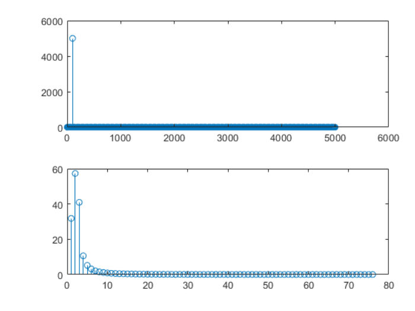

## formant, harmonic and resonator
[https://www.voicescienceworks.org/harmonics-vs-formants.html](tutorial)
[https://person2.sol.lu.se/SidneyWood/praate/whatform.html](harmonic)

harmonic, when close to the resonance frequency of vocal tract, passing freely and formed formant
harmonic, when not close to the resonance frequency of vocal tract, not passing freely and weaken and form troughs bettwen peaks

1. Why need complex?
  - retrain 2d data, widely used in magnet, speech, electrical wave
  - Arithmetic works in complex

2. DFT

$$
{\displaystyle {\begin{aligned}
X_{k}&=\sum _{n=0}^{N-1}x_{n}\cdot e^{-{\frac {i2\pi }{N}}kn}
\end{aligned}}}
$$

  - Deviation
    - Suppose any signal is formed by adding multiple sin function
    - sin functions is orthogonal to each other
    - Multiply a sine function(or complex) to obtain its coefficient since
  - n_fft
    - n_fft is related to resolution by resolution = fs / n_fft, consider Euler's circle(E) is sliced by N
  - Hann Windows
    - The Premise of DFT is a signal: 1. period or extend of period which is hardly meet
    - If the premise is not met, the main frequency magnitude will leak to other frequencies cause spectrum leakage
    - To make the non-period to period, Hann windows initiated
    
    > 1、连续时间周期信号:处理时间连续并且具有周期性的信号，其频域上离散，非周期。  
    > 2、连续时间非周期信号:处理时间连续但是不具有周期性的信号，其频域上连续，非周期。  
    > 3、离散时间非周期信号:处理时间离散，不具有周期性的信号，其频域上连续，有周期性。  
    > 4、离散时间周期信号:处理时间离散，具有周期性的信号，其频域上离散，有周期性。
    [link](https://www.zhihu.com/question/21314374)

3. mels -> mags -> wav
  - mels -> mags is lossy since only left inverse matrix exist!
    $$
    A_{m,g}, m < g \\
    then, \\
    mels = A_{m, g} * mags \\
    mags = A_{m, g}^{-1} * mels (Wrong)
    $$
  - wavegan works from mels -> wav

4. From wav to filter banks to MFCC
  - Pre-Emphasis
    $$
    y(t)=x(t)−αx(t−1)
    $$
  - Framing
  - Window
  - FFT and Power spectrum
    $$
    P=\frac {|FFT(x_{i})|^{2}} {N}
    $$

  - Mel filter
    $$
    m=2595log10(1+f/700) \\
    f=700(10m/2595−1)
    $$
  - Log => (filter bank)
  - DCT (Discrete Cosine Transform )
    - coefficients 2-13
  - Mean Normalization
    - to increase SNR

  [link](https://haythamfayek.com/2016/04/21/speech-processing-for-machine-learning.html)
