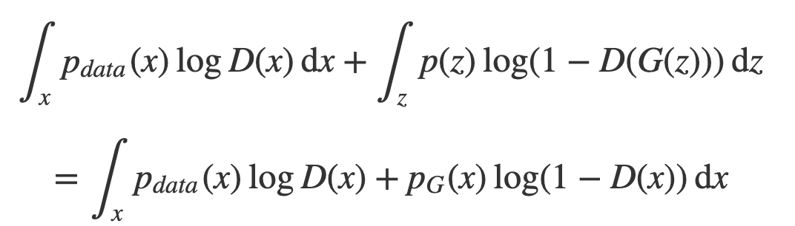

## optimal
  - Shifting Generative problem to Discriminate problem which is easier.
    - The global minimum of the virtual training criterion C(G)=maxV(G,D)_D is acheived if and only if p_G=p_data.
    - Got optimal G if and only if D get maximum, -log4
    -
  - p_G = p_data equals C(G) = -log4

  - why two x merged to same x, it shouldn't be samiliar witout any guarantee.

    - Radon-Nikodym Theorem
    - Law of the unconscious statistician

## convergence

## reference
[proof of gan](https://srome.github.io/An-Annotated-Proof-of-Generative-Adversarial-Networks-with-Implementation-Notes/)
